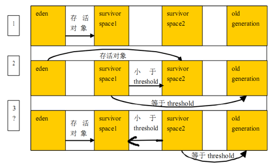

## 义码当仙之Java虚拟机（JVM）

### 什么是HotSpot VM
提起HotSpot VM，相信所有Java程序员都知道，它是Sun JDK和OpenJDK中所带的虚拟机，也是目前使用范围最广的Java虚拟机。
但不一定所有人都知道的是，这个目前看起来“血统纯正”的虚拟机在最初并非由Sun公司开发，而是由一家名为“Longview Technologies”的小公司设计的。
甚至这个虚拟机最初并非是为Java语言而开发的，它来源于Strongtalk VM，而这款虚拟机中相当多的技术又是来源于一款支持Self语言实现“达到C语言50%以上的执行效率”的目标而设计的虚拟机，
Sun公司注意到了这款虚拟机在JIT编译上有许多优秀的理念和实际效果，在1997年收购了Longview Technologies公司，从而获得了HotSpot VM。
HotSpot VM既继承了Sun之前两款商用虚拟机的优点（如前面提到的准确式内存管理），也有许多自己新的技术优势，
如它名称中的HotSpot指的就是它的热点代码探测技术（其实两个VM基本上是同时期的独立产品，HotSpot还稍早一些，HotSpot一开始就是准确式GC，
而Exact VM之中也有与HotSpot几乎一样的热点探测。为了Exact VM和HotSpot VM哪个成为Sun主要支持的VM产品，在Sun公司内部还有过争论，HotSpot打败Exact并不能算技术上的胜利），
HotSpot VM的热点代码探测能力可以通过执行计数器找出最具有编译价值的代码，然后通知JIT编译器以方法为单位进行编译。
如果一个方法被频繁调用，或方法中有效循环次数很多，将会分别触发标准编译和OSR（栈上替换）编译动作。
通过编译器与解释器恰当地协同工作，可以在最优化的程序响应时间与最佳执行性能中取得平衡，而且无须等待本地代码输出才能执行程序，
即时编译的时间压力也相对减小，这样有助于引入更多的代码优化技术，输出质量更高的本地代码。  

在2006年的JavaOne大会上，Sun公司宣布最终会把Java开源，并在随后的一年，陆续将JDK的各个部分（其中当然也包括了HotSpot VM）在GPL协议下公开了源码，
并在此基础上建立了OpenJDK。这样，HotSpot VM便成为了Sun JDK和OpenJDK两个实现极度接近的JDK项目的共同虚拟机。  

在2008年和2009年，Oracle公司分别收购了BEA公司和Sun公司，这样Oracle就同时拥有了两款优秀的Java虚拟机：JRockit VM和HotSpot VM。
Oracle公司宣布在不久的将来（大约应在发布JDK 8的时候）会完成这两款虚拟机的整合工作，使之优势互补。
整合的方式大致上是在HotSpot的基础上，移植JRockit的优秀特性，譬如使用JRockit的垃圾回收器与MissionControl服务，
使用HotSpot的JIT编译器与混合的运行时系统。

### Java内存结构
  

#### Java堆（Java Heap）
java堆是java虚拟机所管理的内存中最大的一块，是被所有线程共享的一块内存区域，在虚拟机启动时创建。此内存区域的唯一目的就是存放对象实例，这一点在Java虚拟机规范中的描述是：所有的对象实例以及数组都要在堆上分配。  
java堆是垃圾收集器管理的主要区域，因此也被成为“GC堆”（Garbage Collected Heap）。从内存回收角度来看java堆可分为：新生代和老生代（当然还有更细致的划分，在下一章会讲到）。
从内存分配的角度看，线程共享的Java堆中可能划分出多个线程私有的分配缓冲区（Thread Local Allocation Buffer，TLAB）。无论怎么划分，都与存放内容无关，无论哪个区域，存储的都是对象实例，进一步的划分都是为了更好的回收内存，或者更快的分配内存。  
根据Java虚拟机规范的规定，java堆可以处于物理上不连续的内存空间中。当前主流的虚拟机都是可扩展的（通过 -Xmx 和 -Xms 控制）。如果堆中没有内存完成实例分配，并且堆也无法再扩展时，将会抛出OutOfMemoryError异常。  

#### 程序计数器（Program Counter Register）
程序计数器是一块较小的内存空间，它可以看作是当前线程所执行的字节码的行号指示器。  
由于Java虚拟机的多线程是通过线程轮流切换并分配处理器执行时间的方式来实现的，一个处理器都只会执行一条线程中的指令。因此，为了线程切换后能恢复到正确的执行位置，每条线程都有一个独立的程序计数器，各个线程之间计数器互不影响，独立存储。
称之为“线程私有”的内存。程序计数器内存区域是虚拟机中唯一没有规定OutOfMemoryError情况的区域。  

#### 方法区（Method Area）
方法区与java堆一样，是各个线程共享的内存区域，它用于存储已被虚拟机加载的类信息、常量、静态变量、即时编译器编译后的代码等数据。它有个别命叫Non-Heap（非堆）。当方法区无法满足内存分配需求时，抛出OutOfMemoryError异常。  

#### 运行时常量池（Runtime Constant Pool）
运行时常量池是方法区的一部分。Class文件中除了有类的版本、字段、方法、接口等描述信息外，还有一项信息是常量池，用于存放编译期生成的各种字面量和符号引用，这部分内容将在加载后进入方法区的运行时常量池中存放。

#### Java虚拟机栈（Java Virtual Machine Stacks）
java虚拟机也是线程私有的，它的生命周期和线程相同。虚拟机栈描述的是Java方法执行的内存模型：每个方法在执行的同时都会创建一个栈帧（Stack Frame）用于存储局部变量表、操作数栈、动态链接、方法出口等信息。  
咱们常说的堆内存、栈内存中，栈内存指的就是虚拟机栈。局部变量表存放了编译期可知的各种基本数据类型（8个基本数据类型）、对象引用（地址指针）、returnAddress类型。  
局部变量表所需的内存空间在编译期间完成分配。在运行期间不会改变局部变量表的大小。  
这个区域规定了两种异常状态：如果线程请求的栈深度大于虚拟机所允许的深度，则抛出StackOverflowError异常；如果虚拟机栈可以动态扩展，在扩展是无法申请到足够的内存，就会抛出OutOfMemoryError异常。  

#### 本地方法栈（Native Method Stack）
本地方法栈与虚拟机栈所发挥作用非常相似，它们之间的区别不过是虚拟机栈为虚拟机执行Java方法（也就是字节码）服务，而本地方法栈则为虚拟机使用到的native方法服务。本地方法栈也是抛出两个异常。  

#### 直接内存（Direct Memory）
直接内存不是虚拟机运行时数据区的一部分，也不是java虚拟机规范中定义的内存区域。但这部分区域也呗频繁使用，而且也可能导致OutOfMemoryError异常。  
在JDK1.4中新加入的NIO（New Input/Output）类，引入了一种基于通道（Channel）与缓冲区（Buffer）的I/O方式，它可以使用Native函数库直接分配堆外内存，然后通过一个存储在java堆中的DirectByteBuffer对象作为这块内存的引用进行操作。  

#### 执行引擎
虚拟机核心的组件就是执行引擎，它负责执行虚拟机的字节码，一般会先进行编译成机器码后执行。  

#### 垃圾收集系统
垃圾收集系统是Java的核心，也是不可少的，Java有一套自己进行垃圾清理的机制，开发人员无需手工清理。  

<hr>

### 垃圾回收机制算法分析

#### 什么是垃圾回收机制
不定时去堆内存中清理不可达对象。不可达的对象并不会马上就会直接回收，垃圾收集器在一个Java程序中的执行是自动的，不能强制执行，即使程序员能明确地判断出有一块内存已经无用了，是应该回收的，程序员也不能强制垃圾收集器回收该内存块。
程序员唯一能做的就是通过调用System.gc 方法来"建议"执行垃圾收集器，但其是否可以执行，什么时候执行却都是不可知的。这也是垃圾收集器的最主要的缺点。当然相对于它给程序员带来的巨大方便性而言，这个缺点是瑕不掩瑜的。  

#### finalize方法作用
Java技术使用finalize()方法在垃圾收集器将对象从内存中清除出去前，做必要的清理工作。这个方法是由垃圾收集器在确定这个对象没有被引用时对这个对象调用的。
它是在Object类中定义的，因此所有的类都继承了它。子类覆盖finalize()方法以整理系统资源或者执行其他清理工作。finalize()方法是在垃圾收集器删除对象之前对这个对象调用的。  

#### 新生代与老年代
Java 中的堆是 JVM 所管理的最大的一块内存空间，主要用于存放各种类的实例对象。  
在 Java 中，堆被划分成两个不同的区域：新生代 ( Young )、老年代 ( Old )。新生代 ( Young ) 又被划分为三个区域：Eden、From Survivor、To Survivor。  
这样划分的目的是为了使 JVM 能够更好的管理堆内存中的对象，包括内存的分配以及回收。  
堆的内存模型大致为：  


默认的，新生代 ( Young ) 与老年代 ( Old ) 的比例的值为 1:2 ( 该值可以通过参数 –XX:NewRatio 来指定 )，即：新生代 ( Young ) = 1/3 的堆空间大小。老年代 ( Old ) = 2/3 的堆空间大小。  
其中，新生代 ( Young ) 被细分为 Eden 和 两个 Survivor 区域，这两个 Survivor 区域分别被命名为 from 和 to，以示区分。  
默认的，Eden : from : to = 8 : 1 : 1 ( 可以通过参数 –XX:SurvivorRatio 来设定 )，即： Eden = 8/10 的新生代空间大小，from = to = 1/10 的新生代空间大小。  

根据垃圾回收机制的不同，Java堆有可能拥有不同的结构，最为常见的就是将整个Java堆分为新生代和老年代。其中新生带存放新生的对象或者年龄不大的对象，老年代则存放老年对象。
新生代分为den区、s0区、s1区，s0和s1也被称为from和to区域，他们是两块大小相等并且可以互相角色的空间。绝大多数情况下，对象首先分配在eden区，在新生代回收后，如果对象还存活，则进入s0或s1区，之后每经过一次
新生代回收，如果对象存活则它的年龄就加1，对象达到一定的年龄后，则进入老年代。  

#### 如何判断对象是否存活
- 引用计数法  
引用计数法就是如果一个对象没有被任何引用指向，则可视之为垃圾。这种方法的缺点就是不能检测到环的存在。首先需要声明，至少主流的Java虚拟机里面都没有选用引用计数算法来管理内存。  
什么是引用计数算法：给对象中添加一个引用计数器，每当有一个地方引用它时，计数器值加１；当引用失效时，计数器值减１。任何时刻计数器值为０的对象就是不可能再被使用的。  
那为什么主流的Java虚拟机里面都没有选用这种算法呢？其中最主要的原因是它很难解决对象之间相互循环引用的问题。另外，引用和去引用伴随加法和减法，影响性能。  

- 根搜索算法  
根搜索算法的基本思路就是通过一系列名为”GC Roots”的对象作为起始点，从这些节点开始向下搜索，搜索所走过的路径称为引用链（Reference Chain），当一个对象到GC Roots没有任何引用链相连时，则证明此对象是不可用的。
这个算法的基本思想是通过一系列称为“GC Roots”的对象作为起始点，从这些节点向下搜索，搜索所走过的路径称为引用链，当一个对象到GC Roots没有任何引用链（即GC Roots到对象不可达）时，则证明此对象是不可用的。  
那么问题又来了，如何选取GCRoots对象呢？在Java语言中，可以作为GCRoots的对象包括下面几种：  
1、虚拟机栈（栈帧中的局部变量区，也叫做局部变量表）中引用的对象。  
2、方法区中的类静态属性引用的对象。  
3、方法区中常量引用的对象。  
4、本地方法栈中JNI(Native方法)引用的对象。  

下面给出一个GCRoots的例子，如下图，为GCRoots的引用链。  
  

根搜索算法的基本思路就是通过一系列名为”GC Roots”的对象作为起始点，从这些节点开始向下搜索，搜索所走过的路径称为引用链(Reference Chain)，当一个对象到GC Roots没有任何引用链相连时，则证明此对象是不可用的。  

  

从上图，reference1、reference2、reference3都是GC Roots，可以看出：  
```text
reference1-> 对象实例1；   
reference2-> 对象实例2；   
reference3-> 对象实例4；   
reference3-> 对象实例4 -> 对象实例6；   
```
可以得出对象实例1、2、4、6都具有GC Roots可达性，也就是存活对象，不能被GC回收的对象。  
而对于对象实例3、5直接虽然连通，但并没有任何一个GC Roots与之相连，这便是GC Roots不可达的对象，这就是GC需要回收的垃圾对象。  

### 垃圾回收策略

### 标记－清除算法
#### 概念
该算法有两个阶段。   
1. 标记阶段：找到所有可访问的对象，做个标记   
2. 清除阶段：遍历堆，把未被标记的对象回收  

#### 应用场景
该算法一般应用于老年代,因为老年代的对象生命周期比较长。  

#### 优缺点
1. 优点  
- 是可以解决循环引用的问题   
- 必要时才回收（内存不足时）  
2. 缺点  
- 回收时，应用需要挂起，也就是stop the world  
- 标记和清除的效率不高，尤其是要扫描的对象比较多的时候  
- 会造成内存碎片（会导致明明有内存空间，但是由于不连续，申请稍微大一些的对象无法做到）  

### 复制算法
#### 概念  
如果jvm使用了coping算法，一开始就会将可用内存分为两块，from域和to域，每次只是使用from域，to域则空闲着。当from域内存不够了，开始执行GC操作，这个时候，会把from域存活的对象拷贝到to域，然后直接把from域进行内存清理。  

#### 应用场景  
coping算法一般是使用在新生代中，因为新生代中的对象一般都是朝生夕死的，存活对象的数量并不多，这样使用coping算法进行拷贝时效率比较高。
jvm将Heap内存划分为新生代与老年代，又将新生代划分为Eden（伊甸园）与2块Survivor Space（幸存者区） ，然后在Eden –> Survivor Space 以及 From Survivor Space 与 To Survivor Space 之间实行Copying算法。
不过jvm在应用coping算法时，并不是把内存按照1:1来划分的，这样太浪费内存空间了。一般的jvm都是8:1。也即是说，Eden区:From区:To区域的比例是始终有90%的空间是可以用来创建对象的，而剩下的10%用来存放回收后存活的对象。  

  

1. 当Eden区满的时候，会触发第一次young gc，把还活着的对象拷贝到Survivor From区；当Eden区再次触发young gc的时候，会扫描Eden区和From区域，对两个区域进行垃圾回收，经过这次回收后还存活的对象，则直接复制到To区域，并将Eden和From区域清空。   
2. 当后续Eden又发生young gc的时候，会对Eden和To区域进行垃圾回收，存活的对象复制到From区域，并将Eden和To区域清空。  
3. 可见部分对象会在From和To区域中复制来复制去,如此交换15次（由JVM参数MaxTenuringThreshold决定，这个参数默认是15），最终如果还是存活，就存入到老年代。  
注意: 万一存活对象数量比较多，那么To域的内存可能不够存放，这个时候会借助老年代的空间。  

#### 优缺点
优点：在存活对象不多的情况下，性能高，能解决内存碎片和java垃圾回收算法之标记清除中导致的引用更新问题。  
缺点：会造成一部分的内存浪费。不过可以根据实际情况，将内存块大小比例适当调整；如果存活对象的数量比较大，coping的性能会变得很差。  

### 标记－压缩算法

#### 概念
标记清除算法和标记压缩算法非常相同，但是标记压缩算法在标记清除算法之上解决内存碎片化。  

  

任意顺序: 即不考虑原先对象的排列顺序，也不考虑对象之间的引用关系，随意移动对象；  
线性顺序: 考虑对象的引用关系，例如a对象引用了b对象，则尽可能将a和b移动到一块；  
滑动顺序: 按照对象原来在堆中的顺序滑动到堆的一端。  

#### 优缺点
优点：解决内存碎片问题  
缺点：压缩阶段，由于移动了可用对象，需要去更新引用。  

### 分代算法

#### 概述
这种算法，根据对象的存活周期的不同将内存划分成几块，新生代和老年代，这样就可以根据各个年代的特点采用最适当的收集算法。可以用抓重点的思路来理解这个算法。  
新生代对象朝生夕死，对象数量多，只要重点扫描这个区域，那么就可以大大提高垃圾收集的效率。另外老年代对象存储久，无需经常扫描老年代，避免扫描导致的开销。  

#### 新生代
在新生代，每次垃圾收集器都发现有大批对象死去，只有少量存活，采用复制算法，只需要付出少量存活对象的复制成本就可以完成收集；  

#### 老年代
老年代中因为对象存活率高、没有额外空间对它进行分配担保，就必须“标记－清除－压缩”算法进行回收。  
新创建的对象被分配在新生代，如果对象经过几次回收后仍然存活，那么就把这个对象划分到老年代。  
老年代区存放Young区Survivor满后触发minor GC后仍然存活的对象，当Eden区满后会将存活的对象放入Survivor区域，如果Survivor区存不下这些对象，
GC收集器就会将这些对象直接存放到Old区中，如果Survivor区中的对象足够老，也直接存放到Old区中。如果Old区满了，将会触发Full GC回收整个堆内存。  

<hr>

### JVM参数配置

#### 常见参数配置

|参数|说明|
|:----|:----|
|-XX:+PrintGC|每次触发GC的时候打印相关日志|
|-XX:+UseSerialGC|串行回收|
|-XX:+PrintGCDetails|更详细的GC日志|
|-Xms|堆初始值|
|-Xmx|堆最大可用值|
|-Xmn|新生代堆最大可用值|
|-XX:SurvivorRatio|用来设置新生代中eden空间和from/to空间的比例|
|-XX:NewRatio|配置新生代与老年代占比 1:2|

总结：在实际工作中，我们可以直接将初始的堆大小与最大堆大小相等，这样的好处是可以减少程序运行时垃圾回收次数，从而提高效率。  

#### 堆内存大小配置
使用示例：-Xmx20m -Xms5m  
说明：当前Java应用最大可用内存为20M，初始内存为5M  
> 示例代码：ymdx-jvm -> jvm-param-config -> Demo01.java  

#### 设置新生代比例参数
使用示例：-Xms20m -Xmx20m -Xmn1m -XX:SurvivorRatio=2 -XX:+PrintGCDetails -XX:+UseSerialGC  
说明：堆初始化内存为20M，堆最大内存为20M，堆新生代最大内存为1M，新生代eden区与from/to区内存占比为2/1，详细打印GC日志，使用窜行垃圾收集器  
> 示例代码：ymdx-jvm -> jvm-param-config -> Demo02.java  

#### 设置新生代与老年代比例参数
使用示例：-Xms20m -Xmx20m -XX:SurvivorRatio=2 -XX:+PrintGCDetails -XX:+UseSerialGC -XX:NewRatio=2  
说明：堆初始化内存为20M，堆最大内存为20M，新生代eden区与from／to区内存占比为2/1，详细打印GC日志，使用窜行垃圾收集器，新生代与老年代内存占比为1/2  
> 示例代码：ymdx-jvm -> jvm-param-config -> Demo03.java  

<hr>

### 实战OutOfMemoryError异常  

#### Java堆溢出
错误原因：java.lang.OutOfMemoryError: Java heap space 堆内存溢出  
解决办法：设置堆内存大小 
```text
-Xms1m -Xmx10m -XX:+PrintGCDetails -XX:+HeapDumpOnOutOfMemoryError  
```
> 示例代码：ymdx-jvm -> jvm-param-config -> OOMDemo.java  

#### 虚拟机栈溢出
错误原因：java.lang.StackOverflowError 栈内存溢出  
栈溢出 产生于递归调用，循环遍历是不会的，但是循环方法里面产生递归调用，也会发生栈溢出。  
解决办法：设置线程最大调用深度，例如：-Xss5m  
> 示例代码：ymdx-jvm -> jvm-param-config -> StackOverflowDemo.java  

#### 内存溢出与内存泄漏区别
Java内存泄漏就是没有及时清理内存垃圾，导致系统无法再给你提供内存资源（内存资源耗尽）；而Java内存溢出就是你要求分配的内存超出了系统能给你的，系统不能满足需求，于是产生溢出。  
内存溢出，这个好理解，说明存储空间不够大。就像倒水倒多了，从杯子上面溢出了来了一样。  
内存泄漏，原理是，使用过的内存空间没有被及时释放，长时间占用内存，最终导致内存空间不足，而出现内存溢出。  

<hr>

### 垃圾收集器

#### 串行与并行收集器
串行回收: JDK1.5前的默认算法。缺点是只有一个线程，执行垃圾回收时程序停止的时间比较长  
并行回收: 多个线程执行垃圾回收适合于追求高吞吐量的系统，回收时系统会停止运行  

#### serial收集器
串行收集器是最古老，最稳定以及效率高的收集器，可能会产生较长的停顿，只使用一个线程去回收。新生代、老年代使用串行回收；新生代复制算法、老年代标记-压缩；垃圾收集的过程中会Stop The World（服务暂停）  
一个单线程的收集器，在进行垃圾收集时候，必须暂停其他所有的工作线程直到它收集结束。  
特点：CPU利用率最高，停顿时间即用户等待时间比较长。  
适用场景：小型应用  
通过JVM参数```-XX:+UseSerialGC```可以使用串行垃圾回收器。  

#### ParNew收集器
ParNew收集器其实就是Serial收集器的多线程版本。新生代并行，老年代串行；新生代复制算法、老年代标记-压缩  
参数控制：
```text
-XX:+UseParNewGC      ParNew收集器  
-XX:ParallelGCThreads 限制线程数量  
```  

#### parallel收集器
Parallel Scavenge收集器类似ParNew收集器，Parallel收集器更关注系统的吞吐量。可以通过参数来打开自适应调节策略，虚拟机会根据当前系统的运行情况收集性能监控信息，
动态调整这些参数以提供最合适的停顿时间或最大的吞吐量；也可以通过参数控制GC的时间不大于多少毫秒或者比例；新生代复制算法、老年代标记－压缩

采用多线程来扫描并压缩堆  
特点：停顿时间短，回收效率高，对吞吐量要求高。  
适用场景：大型应用，科学计算，大规模数据采集等。  
通过JVM参数```XX:+UseParNewGC```打开并发标记扫描垃圾回收器。  

#### cms收集器
CMS（Concurrent Mark Sweep）收集器是一种以获取最短回收停顿时间为目标的收集器。目前很大一部分的Java应用都集中在互联网站或B/S系统的服务端上，这类应用尤其重视服务的响应速度，希望系统停顿时间最短，以给用户带来较好的体验。
从名字（包含“Mark Sweep”）上就可以看出CMS收集器是基于“标记-清除”算法实现的，它的运作过程相对于前面几种收集器来说要更复杂一些，整个过程分为4个步骤，包括：   
1. 初始标记（CMS initial mark）
2. 并发标记（CMS concurrent mark）
3. 重新标记（CMS remark）
4. 并发清除（CMS concurrent sweep）
其中初始标记、重新标记这两个步骤仍然需要“Stop The World”。初始标记仅仅只是标记一下GC Roots能直接关联到的对象，速度很快，并发标记阶段就是进行GC Roots Tracing的过程，
而重新标记阶段则是为了修正并发标记期间，因用户程序继续运作而导致标记产生变动的那一部分对象的标记记录，这个阶段的停顿时间一般会比初始标记阶段稍长一些，但远比并发标记的时间短。  
由于整个过程中耗时最长的并发标记和并发清除过程中，收集器线程都可以与用户线程一起工作，所以总体上来说，CMS收集器的内存回收过程是与用户线程一起并发地执行。老年代收集器（新生代使用ParNew）  

优点：并发收集、低停顿  
缺点：产生大量空间碎片、并发阶段会降低吞吐量  

采用“标记-清除”算法实现，使用多线程的算法去扫描堆，对发现未使用的对象进行回收。  
1. 初始标记  
2. 并发标记  
3. 并发预处理  
4. 重新标记  
5. 并发清除  
6. 并发重置  

特点：响应时间优先，减少垃圾收集停顿时间  
适应场景：大型服务器等。  
通过JVM参数```-XX:+UseConcMarkSweepGC```设置  

#### G1收集器
在G1中，堆被划分成 许多个连续的区域(region)。采用G1算法进行回收，吸收了CMS收集器特点。  
特点：支持很大的堆，高吞吐量  
- 支持多CPU和垃圾回收线程  
- 在主线程暂停的情况下，使用并行收集  
- 在主线程运行的情况下，使用并发收集  

实时目标：可配置在N毫秒内最多只占用M毫秒的时间进行垃圾回收  
通过JVM参数 -XX:+UseG1GC 使用G1垃圾回收器  
注意: 并发是指一个处理器同时处理多个任务。   
并行是指多个处理器或者是多核的处理器同时处理多个不同的任务。  
并发是逻辑上的同时发生（simultaneous），而并行是物理上的同时发生。  
来个比喻：并发是一个人同时吃三个馒头，而并行是三个人同时吃三个馒头。  

<hr>

### Tomcat配置调优测试

> 示例项目：ymdx-jvm -> jvm-web-test  

#### Jmeter压力测试工具

[官方下载地址](http://jmeter.apache.org/download_jmeter.cgi)  

#### 什么是吞吐量
QPS：Queries Per Second意思是“每秒查询率”，是一台服务器每秒能够响应的查询次数，是对一个特定的查询服务器在规定时间内所处理流量多少的衡量标准。  

测试串行吞吐量  
```text
-XX:+PrintGCDetails -Xmx32M -Xms1M
-XX:+HeapDumpOnOutOfMemoryError
-XX:+UseSerialGC
-XX:PermSize=32M

GC回收次数25次，吞吐量4662
 
设置堆的初始值和堆的最大值一致，加大初始堆内存大小，将-Xms1M修改为-Xms32M，GC回收次数7次，吞吐量5144
```

扩大堆的内存  
```text
-XX:+PrintGCDetails -Xmx512M -Xms32M
-XX:+HeapDumpOnOutOfMemoryError
-XX:+UseSerialGC
-XX:PermSize=32M

GC回收次数6次，吞吐量5141
结论：垃圾回收次数和设置最大堆内存大小无关，只和初始内存有关系。
初始内存会影响吞吐量。  
```

调整初始堆  
```text
-XX:+PrintGCDetails -Xmx512M –Xms512M
-XX:+HeapDumpOnOutOfMemoryError
-XX:+UseSerialGC
-XX:PermSize=32M

GC回收次数0次，吞吐量6561次
结论：堆的初始值和最大堆内存一致，并且初始堆越大就会越高。 
```

并行回收（UseParNewGC）  
```text
-XX:+PrintGCDetails -Xmx512M -Xms512M
-XX:+HeapDumpOnOutOfMemoryError
-XX:+UseParNewGC
-XX:PermSize=32M
GC回收0次，吞吐量6800
```

CMS收集器  
```text
-XX:+PrintGCDetails -Xmx512M -Xms512M
-XX:+HeapDumpOnOutOfMemoryError
-XX:+UseConcMarkSweepGC 
-XX:PermSize=32M
```

G1回收方式  
```text
-XX:+PrintGCDetails -Xmx512M -Xms512M
-XX:+HeapDumpOnOutOfMemoryError
-XX:+UseG1GC
-XX:PermSize=32M
```

#### 调优总结
初始堆值和最大堆内存内存越大，吞吐量就越高。  
最好使用并行收集器,因为并行收集器速度比串行吞吐量高，速度快。  
设置堆内存新生代的比例和老年代的比例最好为1:2或者1:3。  
减少GC对老年代的回收。  

<hr>

### 垃圾回收策略  

#### 理解GC日志  

#### Minor GC和Full GC区别  
新生代 GC（Minor GC）：指发生在新生代的垃圾收集动作，因为 Java 对象大多都具备朝生夕灭的特性，所以 Minor GC 非常频繁，一般回收速度也比较快。  
老年代 GC（Major GC / Full GC）：指发生在老年代的 GC，出现了 Major GC，经常会伴随至少一次的 Minor GC（但非绝对的，在 ParallelScavenge 收集器的收集策略里就有直接进行 Major GC 的策略选择过程）。
MajorGC 的速度一般会比 Minor GC 慢 10倍以上。  

Minor GC触发机制：  
当年轻代满时就会触发Minor GC，这里的年轻代满指的是Eden代满，Survivor满不会引发GC  
Full GC触发机制：  
当年老代满时会引发Full GC，Full GC将会同时回收年轻代、年老代，当永久代满时也会引发Full GC，会导致Class、Method元信息的卸载  

其中Minor GC如下图所示  

  

虚拟机给每个对象定义了一个对象年龄（Age）计数器。如果对象在 Eden 出生并经过第一次 Minor GC 后仍然存活，并且能被 Survivor 容纳的话，将被移动到 Survivor 空间中，并将对象年龄设为 1。  
对象在 Survivor 区中每熬过一次 Minor GC，年龄就增加 1 岁，当它的年龄增加到一定程度（默认为 15 岁）时，就会被晋升到老年代中。对象晋升老年代的年龄阈值，可以通过参数 -XX:MaxTenuringThreshold（阈值）来设置。  

#### JVM的永久代中会发生垃圾回收么？
垃圾回收不会发生在永久代，如果永久代满了或者是超过了临界值，会触发完全垃圾回收（Full GC）。如果你仔细查看垃圾收集器的输出信息，就会发现永久代也是被回收的。这就是为什么正确的永久代大小对避免Full GC是非常重要的原因。  
注：Java8中已经移除了永久代，新加了一个叫做元数据区的native内存区  

#### 对象优先在eden分配
大多数情况下，对象在新生代Eden区中分配。当Eden区没有足够的空间进行分配时，虚拟机将发起一次Minor GC。  
虚拟机提供了-XX:+PrintGCDetails这个收集器日志参数，告诉虚拟机在发生垃圾收集行为时打印内存回收日志，并且在进程退出的时候输出当前内存各区域的分配情况。
在实际应用中，内存回收日志一般是打印到文件后通过日志工具进行分析，不过本实验的日志并不多，直接阅读就能看得很清楚。  

#### 大对象直接进入老年代

#### 长期存活的对象将进入老年代

#### 动态对象年龄判断

#### 空间分配担保

#### JDK可视化工具

- JConsole  

从Java 5开始 引入了 JConsole。JConsole 是一个内置 Java 性能分析器，可以从命令行或在 GUI shell 中运行。
您可以轻松地使用 JConsole（或者，它更高端的 “近亲” VisualVM ）来监控 Java 应用程序性能和跟踪 Java 中的代码。  
如果是从命令行启动，使 JDK 在 PATH 上，运行 jconsole 即可。  
如果从 GUI shell 启动，找到 JDK 安装路径，打开 bin 文件夹，双击 jconsole 。  
当分析工具弹出时（取决于正在运行的 Java 版本以及正在运行的 Java 程序数量），可能会出现一个对话框，要求输入一个进程的 URL 来连接，也可能列出许多不同的本地 Java 进程（有时包含 JConsole 进程本身）来连接。

- VisualVm  

VisualVM 是一款免费的，集成了多个 JDK 命令行工具的可视化工具，它能为您提供强大的分析能力，对 Java 应用程序做性能分析和调优。  
这些功能包括生成和分析海量数据、跟踪内存泄漏、监控垃圾回收器、执行内存和 CPU 分析，同时它还支持在 MBeans 上进行浏览和操作。  

### 字节码技术

> 示例项目：ymdx-jvm -> jvm-bytecode  

#### 字节码技术应用场景
AOP技术、Lombok去除重复代码插件、动态修改class文件等  

#### 字节技术优势
Java字节码增强指的是在Java字节码生成之后，对其进行修改，增强其功能，这种方式相当于对应用程序的二进制文件进行修改。Java字节码增强主要是为了减少冗余代码，提高性能等。  
实现字节码增强的主要步骤为：  
1. 修改字节码  
在内存中获取到原来的字节码，然后通过一些工具（如 ASM，Javaasist）来修改它的byte[]数组，得到一个新的byte数组。  
2. 使修改后的字节码生效  
有两种方法：
- 自定义ClassLoader来加载修改后的字节码；  
- 替换掉原来的字节码：在JVM加载用户的Class时，拦截，返回修改后的字节码；或者在运行时，使用Instrumentation.redefineClasses方法来替换掉原来的字节码  

#### 常见的字节码操作类库

- BCEL
Byte Code Engineering Library(BCEL)，这是Apache Software Foundation的Jakarta项目的一部分。  
BCEL是Java classworking 广泛使用的一种框架，它可以让您深入jvm汇编语言进行类库操作的细节。  
BCEL与javassist有不同的处理字节码方法，BCEL在实际的jvm指令层次上进行操作（BCEL拥有丰富的jvm指令集支持），而javassist所强调的是源代码级别的工作。    

- ASM
是一个轻量级Java字节码操作框架，直接涉及到JVM底层的操作和指令  
高性能，高质量  

- CGLIB
生成类库，基于ASM实现  

- javassist  
是一个开源的框架，编辑和创建Java字节码的类库。性能较ASM差，跟cglib差不多，但是使用简单。很多开源框架都在使用它。  
javassist 的最外层的API和JAVA的反射包中的API颇为类似。它主要由 CtClass， CtMethod 以及 CtField 几个类组成。用以执行和JDK反射API中 java.lang.Class，java.lang.reflect.Method，java.lang.reflect.Method.Field 相同的操作。  

#### javassist优势：  
比反射开销小，性能高。javassist性能高于反射，低于ASM  

运行时操作字节码可以让我们实现如下功能：  
1. 动态生成新的类  
2. 动态改变某个类的结构 ( 添加、删除、修改新的属性或方法 )  

方法操作  
- 修改已有方法的方法体（插入代码到已有方法体）  
- 新增方法  
- 删除方法  

#### javassist的局限性  
JDK5.0 新语法不支持 ( 包括泛型、枚举 ) ，不支持注解修改，但可以通过底层的 javassist 类来解决，具体参考：javassist.bytecode.annotation  
不支持数组的初始化，如 String[]{"1","2"} ，除非只有数组的容量为1  
不支持内部类和匿名类  
不支持 continue 和 break表达式。  
对于继承关系，有些不支持。例如：    
```text
class A {}  
class B extends A {} 
class C extends B {}
```

<hr>

### 类加载器  

> 示例项目：ymdx-jvm -> jvm-classloader  

#### 类加载机制的层次结构
每个编写的”.java”拓展名类文件都存储着需要执行的程序逻辑，这些”.java”文件经过Java编译器编译成拓展名为”.class”的文件，”.class”文件中保存着Java代码经转换后的虚拟机指令，
当需要使用某个类时，虚拟机将会加载它的”.class”文件，并创建对应的class对象，将class文件加载到虚拟机的内存，这个过程称为类加载，这里我们需要了解一下类加载的过程，如下：  
Jvm执行class文件  

  

#### 步骤一：类加载机制
将class文件字节码内容加载到内存中，并将这些静态数据转换成方法区中的运行时数据结构，在堆中生成一个代表这个类的java.lang.Class对象，作为方法区类数据的访问入口，这个过程需要类加载器参与。  
当系统运行时，类加载器将.class文件的二进制数据从外部存储器（如光盘，硬盘）调入内存中，CPU再从内存中读取指令和数据进行运算，并将运算结果存入内存中。
内存在该过程中充当着"二传手"的作用，通俗的讲，如果没有内存，类加载器从外部存储设备调入.class文件二进制数据直接给CPU处理，而由于CPU的处理速度远远大于调入数据的速度，容易造成数据的脱节，所以需要内存起缓冲作用。  
类将.class文件加载至运行时的方法区后，会在堆中创建一个Java.lang.Class对象，用来封装类位于方法区内的数据结构，该Class对象是在加载类的过程中创建的，
每个类都对应有一个Class类型的对象，Class类的构造方法是私有的，只有JVM能够创建。因此Class对象是反射的入口，使用该对象就可以获得目标类所关联的.class文件中具体的数据结构。  

  

#### 步骤二：链接过程
将java类的二进制代码合并到JVM的运行状态之中的过程  
验证：确保加载的类信息符合JVM规范，没有安全方面的问题  
准备：正式为类变量（static变量）分配内存并设置类变量初始值的阶段，这些内存都将在方法区中进行分配  
解析：虚拟机常量池的符号引用替换为字节引用过程  

#### 步骤三：初始化  
初始化阶段是执行类构造器```<clinit>()```方法的过程。类构造器```<clinit>()```方法是由编译器自动收藏类中的所有类变量的赋值动作和静态语句块（static块）中的语句合并产生，代码从上往下执行。  
当初始化一个类的时候，如果发现其父类还没有进行过初始化，则需要先触发其父类的初始化  
虚拟机会保证一个类的```<clinit>()```方法在多线程环境中被正确加锁和同步  
当范围一个Java类的静态域时，只有真正声明这个域的类才会被初始化  

#### 类加载器的层次结构
启动（Bootstrap）类加载器  
扩展（Extension）类加载器  
系统（System）类加载器  

  

#### 启动（Bootstrap）类加载器
启动类加载器主要加载的是JVM自身需要的类，这个类加载使用C++语言实现的，是虚拟机自身的一部分，它负责将<JAVA_HOME>/lib路径下的核心类库或-Xbootclasspath参数指定的路径下的jar包加载到内存中，
注意必由于虚拟机是按照文件名识别加载jar包的，如rt.jar，如果文件名不被虚拟机识别，即使把jar包丢到lib目录下也是没有作用的（出于安全考虑，Bootstrap启动类加载器只加载包名为java、javax、sun等开头的类）。  

#### 扩展（Extension）类加载器
扩展类加载器是指Sun公司（已被Oracle收购）实现的sun.misc.Launcher$ExtClassLoader类，由Java语言实现的，是Launcher的静态内部类，
它负责加载<JAVA_HOME>/lib/ext目录下或者由系统变量-Djava.ext.dir指定位路径中的类库，开发者可以直接使用标准扩展类加载器。  

#### 系统（System）类加载器
也称应用程序加载器是指Sun公司实现的sun.misc.Launcher$AppClassLoader。它负责加载系统类路径java -classpath或-Djava.class.path 指定路径下的类库，也就是我们经常用到的classpath路径，
开发者可以直接使用系统类加载器，一般情况下该类加载器是程序中默认的类加载器，通过ClassLoader#getSystemClassLoader()方法可以获取到该类加载器。  
在Java的日常应用程序开发中，类的加载几乎是由上述3种类加载器相互配合执行的，在必要时，我们还可以自定义类加载器，需要注意的是，Java虚拟机对class文件采用的是按需加载的方式，
也就是说当需要使用该类时才会将它的class文件加载到内存生成class对象，而且加载某个类的class文件时，Java虚拟机采用的是双亲委派模式，即把请求交由父类处理，它是一种任务委派模式。  

#### 理解双亲委派模式
采用双亲委派模式的是好处是Java类随着它的类加载器一起具备了一种带有优先级的层次关系，通过这种层级关可以避免类的重复加载，当父亲已经加载了该类时，就没有必要子ClassLoader再加载一次。
其次是考虑到安全因素，java核心api中定义类型不会被随意替换，假设通过网络传递一个名为java.lang.Integer的类，通过双亲委托模式传递到启动类加载器，而启动类加载器在核心Java API发现这个名字的类，
发现该类已被加载，并不会重新加载网络传递的过来的java.lang.Integer，而直接返回已加载过的Integer.class，这样便可以防止核心API库被随意篡改。
可能你会想，如果我们在classpath路径下自定义一个名为java.lang.SingleInteger类（该类是胡编的）呢？该类并不存在java.lang中，经过双亲委托模式，传递到启动类加载器中，
由于父类加载器路径下并没有该类，所以不会加载，将反向委托给子类加载器加载，最终会通过系统类加载器加载该类。但是这样做是不允许，因为java.lang是核心API包，需要访问权限，
强制加载将会报出如下异常java.lang.SecurityException: Prohibited package name: java.lang  

所以无论如何都无法加载成功的。下面我们从代码层面了解几个Java中定义的类加载器及其双亲委派模式的实现，它们类图关系如下  

  

双亲委派模式是在Java 1.2后引入的，其工作原理的是，如果一个类加载器收到了类加载请求，它并不会自己先去加载，而是把这个请求委托给父类的加载器去执行，如果父类加载器还存在其父类加载器，
则进一步向上委托，依次递归，请求最终将到达顶层的启动类加载器，如果父类加载器可以完成类加载任务，就成功返回，倘若父类加载器无法完成此加载任务，子加载器才会尝试自己去加载，这就是双亲委派模式，
即每个儿子都很懒，每次有活就丢给父亲去干，直到父亲说这件事我也干不了时，儿子自己想办法去完成，这不就是传说中的实力坑爹吗？那么采用这种模式有啥用呢?  

#### 双亲委派模式优势
采用双亲委派模式的是好处是Java类随着它的类加载器一起具备了一种带有优先级的层次关系，通过这种层级关可以避免类的重复加载，当父亲已经加载了该类时，就没有必要子ClassLoader再加载一次。
其次是考虑到安全因素，java核心api中定义类型不会被随意替换，假设通过网络传递一个名为java.lang.Integer的类，通过双亲委托模式传递到启动类加载器，而启动类加载器在核心Java API发现这个名字的类，
发现该类已被加载，并不会重新加载网络传递的过来的java.lang.Integer，而直接返回已加载过的Integer.class，这样便可以防止核心API库被随意篡改。
可能你会想，如果我们在classpath路径下自定义一个名为java.lang.SingleInteger类（该类是胡编的）呢？该类并不存在java.lang中，经过双亲委托模式，传递到启动类加载器中，由于父类加载器路径下并没有该类，
所以不会加载，将反向委托给子类加载器加载，最终会通过系统类加载器加载该类。但是这样做是不允许，因为java.lang是核心API包，需要访问权限。    

#### 类加载器间的关系
我们进一步了解类加载器间的关系（并非指继承关系），主要可以分为以下4点  
启动类加载器，由C++实现，没有父类。  
拓展类加载器（ExtClassLoader），由Java语言实现，父类加载器为null  
系统类加载器（AppClassLoader），由Java语言实现，父类加载器为ExtClassLoader  
自定义类加载器，父类加载器肯定为AppClassLoader。  

#### 类加载器常用方法

- loadClass(String)  

该方法加载指定名称（包括包名）的二进制类型，该方法在JDK1.2之后不再建议用户重写但用户可以直接调用该方法，loadClass()方法是ClassLoader类自己实现的，
该方法中的逻辑就是双亲委派模式的实现，其源码如下，loadClass(String name, boolean resolve)是一个重载方法，resolve参数代表是否生成class对象的同时进行解析相关操作。  
正如loadClass方法所展示的，当类加载请求到来时，先从缓存中查找该类对象，如果存在直接返回，如果不存在则交给该类加载去的父加载器去加载，倘若没有父加载则交给顶级启动类加载器去加载，
最后倘若仍没有找到，则使用findClass()方法去加载（关于findClass()稍后会进一步介绍）。从loadClass实现也可以知道如果不想重新定义加载类的规则，也没有复杂的逻辑，只想在运行时加载自己指定的类，
那么我们可以直接使用this.getClass().getClassLoader.loadClass("className")，这样就可以直接调用ClassLoader的loadClass方法获取到class对象。  

- findClass(String)  

在JDK1.2之前，在自定义类加载时，总会去继承ClassLoader类并重写loadClass方法，从而实现自定义的类加载类，但是在JDK1.2之后已不再建议用户去覆盖loadClass()方法，
而是建议把自定义的类加载逻辑写在findClass()方法中，从前面的分析可知，findClass()方法是在loadClass()方法中被调用的，当loadClass()方法中父加载器加载失败后，
则会调用自己的findClass()方法来完成类加载，这样就可以保证自定义的类加载器也符合双亲委托模式。需要注意的是ClassLoader类中并没有实现findClass()方法的具体代码逻辑，
取而代之的是抛出ClassNotFoundException异常，同时应该知道的是findClass方法通常是和defineClass方法一起使用的  

- defineClass(byte[] b, int off, int len)  

defineClass()方法是用来将byte字节流解析成JVM能够识别的Class对象（ClassLoader中已实现该方法逻辑），通过这个方法不仅能够通过class文件实例化class对象，
也可以通过其他方式实例化class对象，如通过网络接收一个类的字节码，然后转换为byte字节流创建对应的Class对象，defineClass()方法通常与findClass()方法一起使用，
一般情况下，在自定义类加载器时，会直接覆盖ClassLoader的findClass()方法并编写加载规则，取得要加载类的字节码后转换成流，然后调用defineClass()方法生成类的Class对象  

- resolveClass(Class<?> c)  

使用该方法可以使用类的Class对象创建完成也同时被解析。前面我们说链接阶段主要是对字节码进行验证，为类变量分配内存并设置初始值同时将字节码文件中的符号引用转换为直接引用。  

#### 热部署
对于Java应用程序来说，热部署就是在运行时更新Java类文件。  

#### 热部署的原理是什么
想要知道热部署的原理，必须要了解java类的加载过程。一个java类文件到虚拟机里的对象，要经过如下过程。  

首先通过java编译器，将java文件编译成class字节码，类加载器读取class字节码，再将类转化为实例，对实例newInstance就可以生成对象。  
类加载器ClassLoader功能，也就是将class字节码转换到类的实例。  
在java应用中，所有的实例都是由类加载器加载而来。  
一般在系统中，类的加载都是由系统自带的类加载器完成，而且对于同一个全限定名的java类（如com.ymdx.jvm.HelloWorld），只能被加载一次，而且无法被卸载。  
这个时候问题就来了，如果我们希望将java类卸载，并且替换更新版本的java类，该怎么做呢？  
既然在类加载器中，java类只能被加载一次，并且无法卸载。那是不是可以直接把类加载器给换了？答案是可以的，我们可以自定义类加载器，并重写ClassLoader的findClass方法。想要实现热部署可以分以下三个步骤：  
1. 销毁该自定义ClassLoader  
2. 更新class类文件  
3. 创建新的ClassLoader去加载更新后的class类文件。  

#### Java热部署与热加载

1、Java热部署与热加载的联系  
- 不重启服务器编译／部署项目  
- 基于Java的类加载器实现  

2、Java热部署与热加载的区别  
- 部署方式  
热部署在服务器运行时重新部署项目  
热加载在运行时重新加载class  
 
- 实现原理  
热部署直接重新加载整个应用  
热加载在运行时重新加载class  
 
- 使用场景  
热部署更多的是在生产环境使用  
热加载则更多的是在开发环境使用  

<hr>

